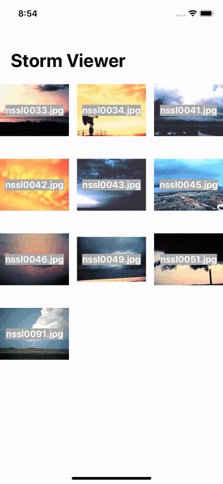

# Storm Viewer
**Project1** of [100DaysOfSwift](https://www.hackingwithswift.com/100) by [@twostraws](https://github.com/twostraws)\
This app showed a list of pictures in a TableView. If you clicked an image a DetailView slides in and shows the whole image.<br>
Now it is a collection view! Much cooler!



## Techniques
- UITableView
- UIImageView
- UIImage
- App Bundles
- FileManager
- Typecasting
- Storyboard
- AutoLayout
and more...

## Important

Get an array of strings with all files in the bundle:
```swift
let fm = FileManager.default
let path = Bundle.main.resourcePath!
let items = try! fm.contentsOfDirectory(atPath: path)
```
Large title in navigation controller:
```swift
navigationController?.navigationBar.prefersLargeTitles = true
```
Hide navigation bar on tap (best to be called in viewWillAppear()):
```swift
navigationController?.hidesBarsOnTap = true
'''