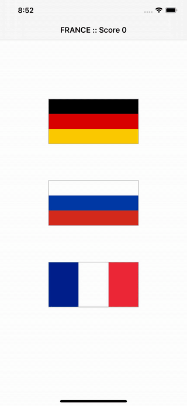

# Flags (Day 19-21)
**Project 2** of [100DaysOfSwift](https://www.hackingwithswift.com/100) by [@twostraws](https://github.com/twostraws)\
This app is a game. You get the name of a country and you have to select the correct flag out of three.

## Techniques
- IBOutlets/IBActions
- UIButton
- CALayer
- UIColor
- UIAlertController
and more...
