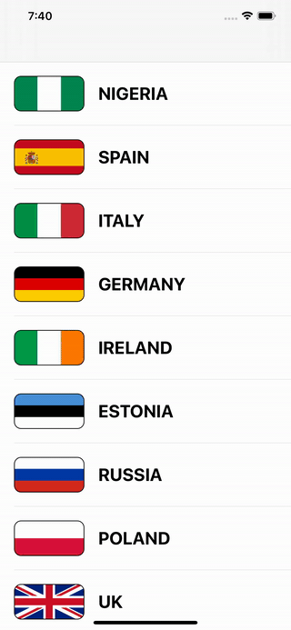

# Flag-Viewer (Day 23)

**Milestone Challenge** of [100DaysOfSwift](https://www.hackingwithswift.com/100) by [@twostraws](https://github.com/twostraws)\
This app shows a list of Flags in a TableView. If you click a flag a DetailView slides in and shows the whole flag.

## Techniques
All the techniques of Project 1 - 3
