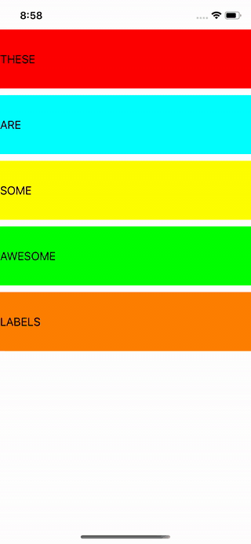

# Auto-Layout (Day 30-31)
**Project 6** of 100DaysOfSwift by @twostraws \
This app shows 5 simple labels with background colors. They are auto layouted so the fit every device in every orientation.
The code shows two possibilities: Visual Formating Language (VFL) or AutoLayout-constraints.

## Techniques
- UI in code
- VFL
- Constraints
- puh
and more...

