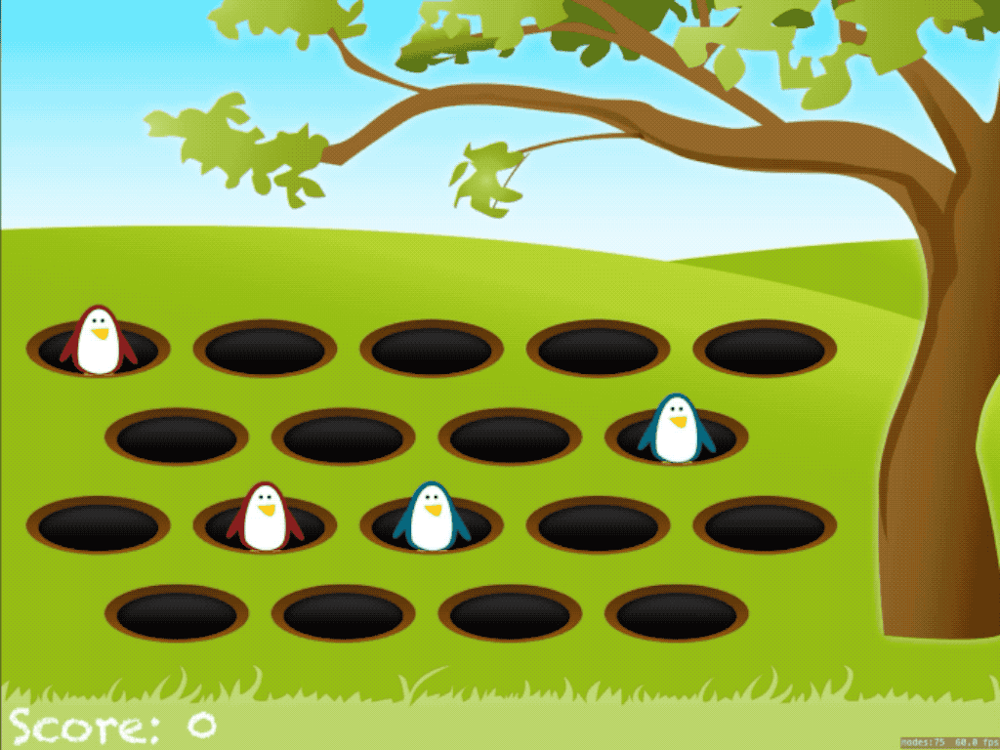

# Whack-A-Mole (Day 55-56)
**Project 14** of [100DaysOfSwift](https://www.hackingwithswift.com/100) by [@twostraws](https://github.com/twostraws)\
This app is a game. Beat the bad penguins!

## Techniques
- SKCropNode
- SKTexture
- asyncAfter()
- SKAction
and more...
