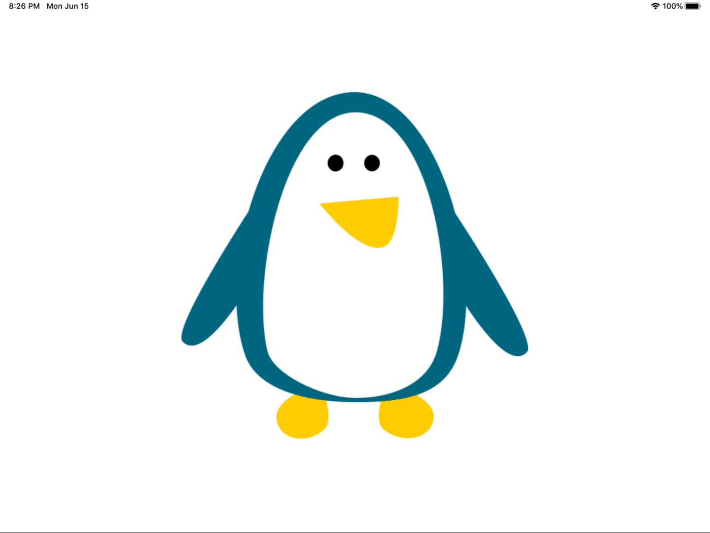

# Animation (Day 57-58)
**Project 15** of [100DaysOfSwift](https://www.hackingwithswift.com/100) by [@twostraws](https://github.com/twostraws)\
Let the penguin do some animations.

## Techniques
- UIView.animate(withDuration:)
- Spring Animations
- CGAffineTransform
- alpha
and more...
