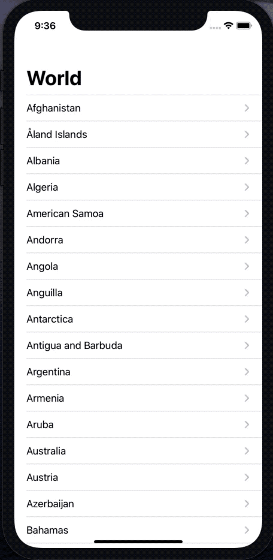

# World (Day 59)

**Consolidation Project V** of [100DaysOfSwift](https://www.hackingwithswift.com/100) by [@twostraws](https://github.com/twostraws)\
This app displays data from https://restcountries.eu in a nice way.

## Techniques
- JSON Parsing with Codable
- SVG-Images with Macaw
- NetworkManager as Singleton
and more...
