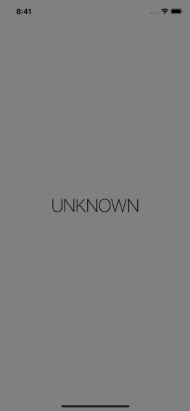

# Detect-a-Beacon (Day 75-76)
**Project 22** of [100DaysOfSwift](https://www.hackingwithswift.com/100) by [@twostraws](https://github.com/twostraws)\
This app detects an iBeacon.

## Techniques
- LocationManager
- CLBeaconIdentityConstraint
- CLBeaconRegion
and more...
