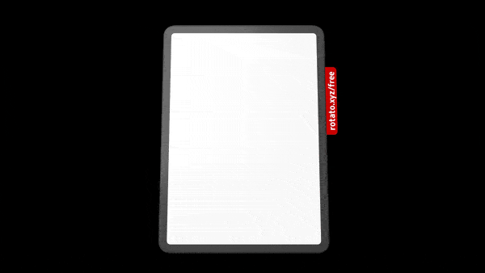

# CoreGraphics (Day 88-89)
**Project 27** of [100DaysOfSwift](https://www.hackingwithswift.com/100) by [@twostraws](https://github.com/twostraws)\
Make some nice drawings with CoreGraphics.

## Techniques
- CoreGraphics
- UIGraphicsImageRenderer
- cgContext
and more...

Trying out Rotato App: 

